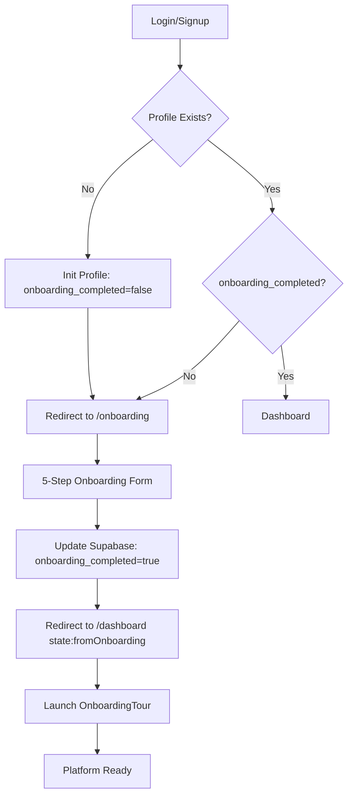

# Dabby Onboarding Flow (Post-Authentication)

This document outlines the user onboarding journey within Dabby after a user successfully authenticates via Supabase (Email/Password or Google OAuth).

## 1. Authentication & Initial State
When a user logs in via [Login.jsx](file:///c:/Users/Medhansh%20Pc/Desktop/Datalis_Each_Device/Dabby/src/Auth/Login.jsx) or signs up via [Signup.jsx](file:///c:/Users/Medhansh%20Pc/Desktop/Datalis_Each_Device/Dabby/src/Auth/Signup.jsx), the following occurs:
- **Supabase Session**: A session is established.
- **AuthContext**: The [AuthContext.jsx](file:///c:/Users/Medhansh%20Pc/Desktop/Datalis_Each_Device/Dabby/src/context/AuthContext.jsx) detects the new user and attempts to fetch their profile from the `profiles` table.
- **Profile Initialization**: If no profile exists (new user), a default profile state is initialized with `onboarding_completed: false`.

## 2. Protected Route Gatekeeping
The [ProtectedRoute.jsx](file:///c:/Users/Medhansh%20Pc/Desktop/Datalis_Each_Device/Dabby/src/Auth/ProtectedRoute.jsx) component acts as a traffic controller for authenticated users:
- **Condition 1**: If the user is logged in but `profile.onboarding_completed` is `false`, they are automatically redirected to `/onboarding`.
- **Condition 2**: If the user is logged in and `onboarding_completed` is `true`, but they try to access `/onboarding` manually, they are redirected back to the `/dashboard`.

## 3. Onboarding Questionnaire
The [Onboarding.jsx](file:///c:/Users/Medhansh%20Pc/Desktop/Datalis_Each_Device/Dabby/src/pages/Onboarding.jsx) page collects essential business and personal information through a multi-step form (5 steps):

### Step 1: Personal Profile
- Full Name
- Job Title

### Step 2: Industry & Scale
- Industry type
- Company size
- Domain

### Step 3: Company Details
- Company Name
- CIN (Corporate Identification Number)
- PAN (Permanent Account Number)
- Director Name

### Step 4: Integration Preferences
- Preference for Zoho integration (Yes/No)

### Step 5: Final Review & Activation
- Summary of provided details.
- Upon clicking **"Complete Onboarding"**, the `handleSubmit` function:
    1. Updates the `profiles` table in Supabase with all form data.
    2. Sets `onboarding_completed: true`.
    3. Updates the local `profile` state in [AuthContext.jsx](file:///c:/Users/Medhansh%20Pc/Desktop/Datalis_Each_Device/Dabby/src/context/AuthContext.jsx).
    4. Navigates the user to `/dashboard` with a `fromOnboarding: true` state flag.

## 4. Post-Onboarding Interactive Tour
Once the user lands on the dashboard after completing the form, the [MainApp.jsx](file:///c:/Users/Medhansh%20Pc/Desktop/Datalis_Each_Device/Dabby/src/components/MainApp.jsx) triggers an interactive guided tour.

- **Trigger**: The `useEffect` in `MainApp` checks for `location.state.fromOnboarding` or if `profile.onboarding_completed` is `false` for a new session.
- **Component**: [OnboardingTour.jsx](file:///c:/Users/Medhansh%20Pc/Desktop/Datalis_Each_Device/Dabby/src/components/Onboarding/OnboardingTour.jsx) launches a series of spotlight steps.
- **Tour Steps**:
    - **Welcome**: Overview of Dabby's capabilities.
    - **Navigation**: Explains the sidebar and different modules (KPIs, Visuals, Workbenches).
    - **Chat Interface**: Shows how to interact with the AI assistant.
    - **File Management**: Guides the user on how to upload and organize data files.
- **Completion**: Once the tour is finished, the user is fully "activated" and ready to use the platform.

## 5. Technical Flow Summary

